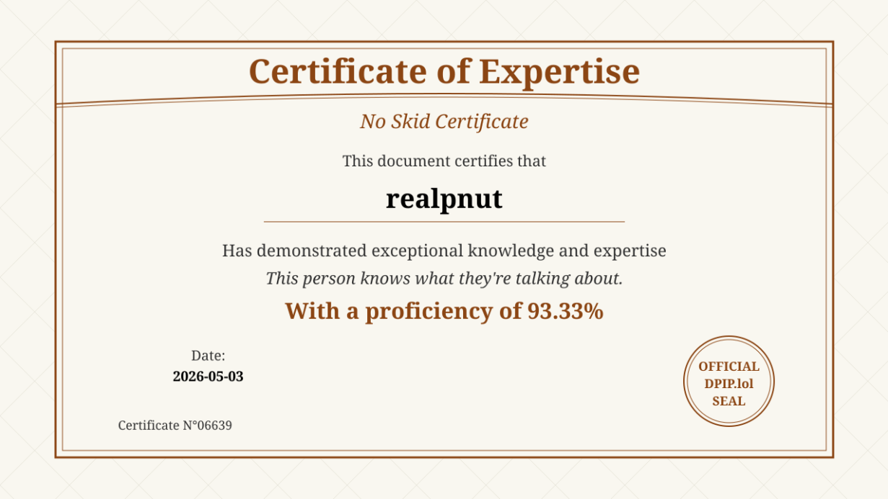

# 💫 About Me:
cybersecurity amateur, definitely not russian agent<br><br>explorer of internet's farlands


## 🌐 Socials:
[](https://youtube.com/@pnuthacker) [](mailto:pnutvacation@gmail.com) [](https://realpnut.github.io/)

## 📜 NoSkid Cert
<details>
  <summary>📜 Certificate</summary>

  

</details>

# 💻 Tech Stack

## 🧠 Languages


## ☁️ Cloud / Platforms


## 🔌 Electronics / IoT


## 🎨 Tools


# 📊 GitHub Stats:
<br/>
<br/>

#
```
"Normies all staring asking how the dude do it
Built an empire off of puters that i rooted"
```
